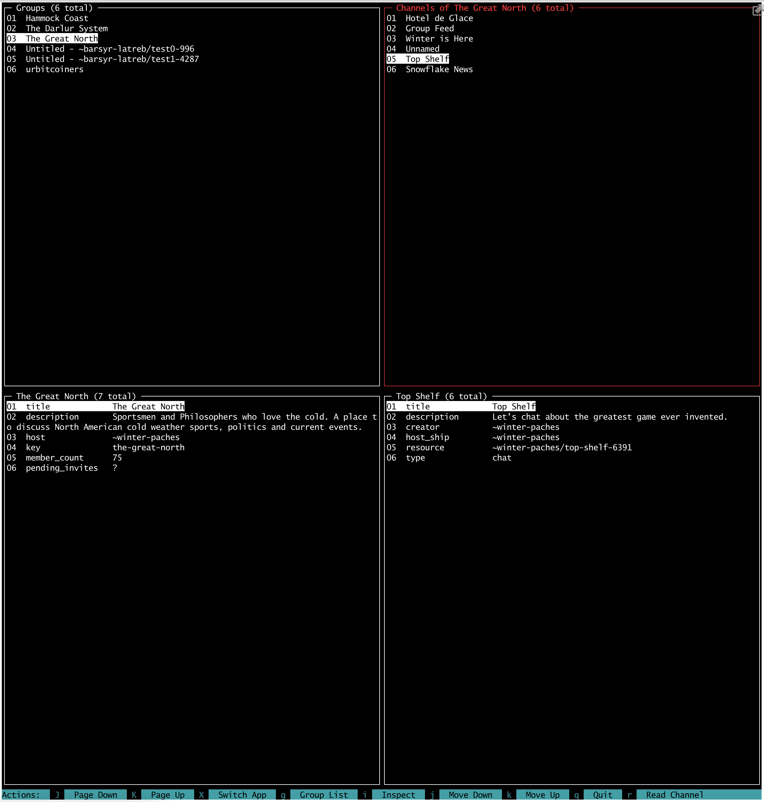
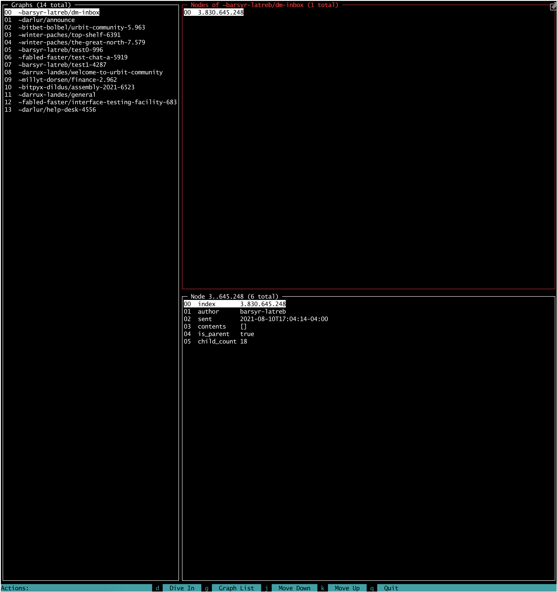

# Mars::Base::10

This is the urbit console you have been waiting for

## Installation

Add this line to your application's Gemfile:

```ruby
gem 'mars_base_10'
```

And then execute:

    $ bundle install

Or install it yourself as:

    $ gem install mars_base_10

## Usage

```
$ mb10 --help
  __  __                         ____                          _    ___
 |  \/  |   __ _   _ __   ___   | __ )    __ _   ___    ___   / |  / _ \
 | |\/| |  / _` | | '__| / __|  |  _ \   / _` | / __|  / _ \  | | | | | |
 | |  | | | (_| | | |    \__ \  | |_) | | (_| | \__ \ |  __/  | | | |_| |
 |_|  |_|  \__,_| |_|    |___/  |____/   \__,_| |___/  \___|  |_|  \___/

Commands:
  mb10 help, --help, -h        # Describe available commands or one specific command
  mb10 launch  [SHIP_CONFIG]   # Start Mars Base 10 connected to the Urbit ship defined in SHIP_CONFIG. (Required)
  mb10 version, --version, -v  # print the version number, then exit

Options:
  [--no-color]  # Disable colorization in output
```
### Basic Usage and Navigation

#### Group Explorer

When you initially open the app you will see the Group Explorer with the group list pane highlighted in red:


Properties of the group are displayed below in the Group details pane.

From here you can choose a group by moving up (k) and down (j) using vim-style motion or jump immediately by typing the row number (04).
The channel list pane will change automatically as you change the group.
Use "Inspect" (i) to select a group and move the focus to the channel list pane.



Properties of the channel are displayed below in the Channel details pane.

By pressing "Switch App" (X) you will swap to the Graph Explorer with the graph list pane highlighted in red:

#### Graph Explorer


From here you can choose a graph by moving up (k) and down (j) using vim-style motion or jump immediately by typing the row number (04). The node list pane will change automatically as you change the graph. Use "Inspect" (i) to select a graph and move the focus to the node list pane.



If, as shown in the picture, the node you as inspecting has children, you can "Dive" (d) into those children and look at them.


Use "Pop" (p) to return to the parent node. You can return focus to the graph list pane by pressing (g).

## Contributing

Bug reports are welcome on GitHub at https://github.com/Zaxonomy/mars-base-10.

This is 100% alpha code and a work in progress. It is not ready yet for  contributions, but I would love any constructive feedback.

## License

The gem is available as open source under the terms of the [MIT License](https://opensource.org/licenses/MIT).
